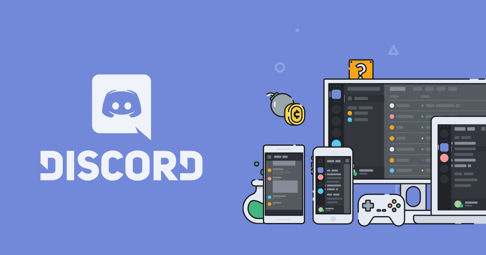

<!-- markdownlint-disable -->

 
<h1><code>discord</code></h1>

> Discord is a voice, video, and text chat app designed specifically for gamers. It's free, secure, and works on both desktop and phone.

This is a repository full of resources to do with developing bots for Discord. It includes everything a bot developer would need, including stuff like the best practices for a Discord Bot, a list of Discord API libraries, examples of ping bots in various libraries, and links to other more sophisticated examples of bots written in those libraries.

## Contents 📜

- [The best practices for Discord Bots](best-practices.md)
- [Libraries for creating Discord Bots](libraries.md)
- [Handy code snippets for Discord Bot development](snippets.md)
- [Examples of Discord Bots written in various libraries](examples/readme.md)
