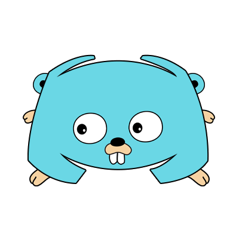
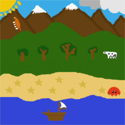

<!-- markdownlint-disable -->

 
<h1>Examples 🤖</h1>

Within this directory you can find various examples of Discord Bots written in different libraries.

## Libraries covered 📜

 
<a href="discordjs/">discord.js</a> 
 
 

 
<a href="discordpy/">discord.py</a>
 
 

 
<a href="Discordgo/">Discordgo</a>
 
 

 
<a href="serenity/">serenity</a>
