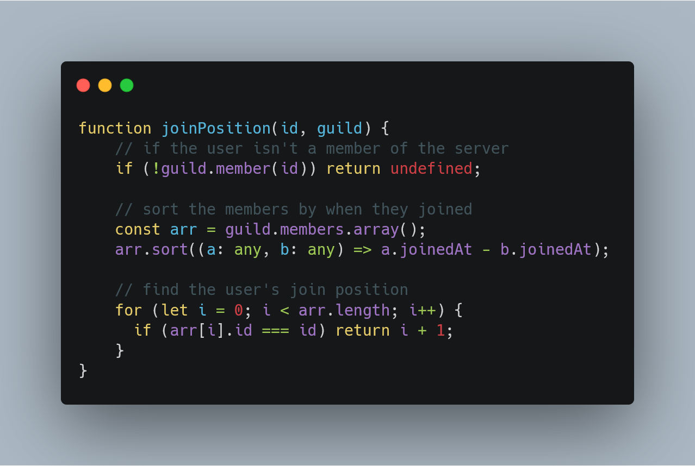
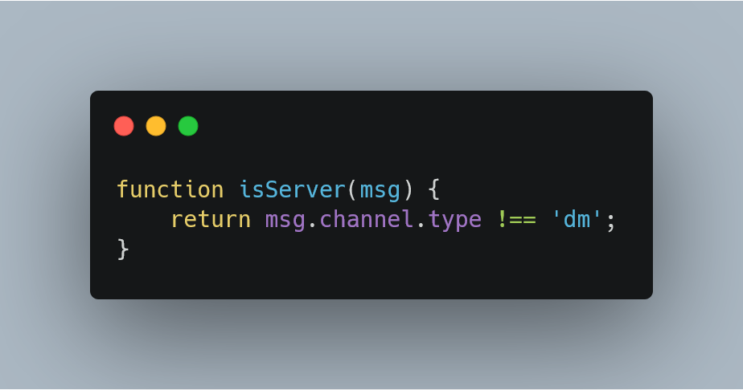
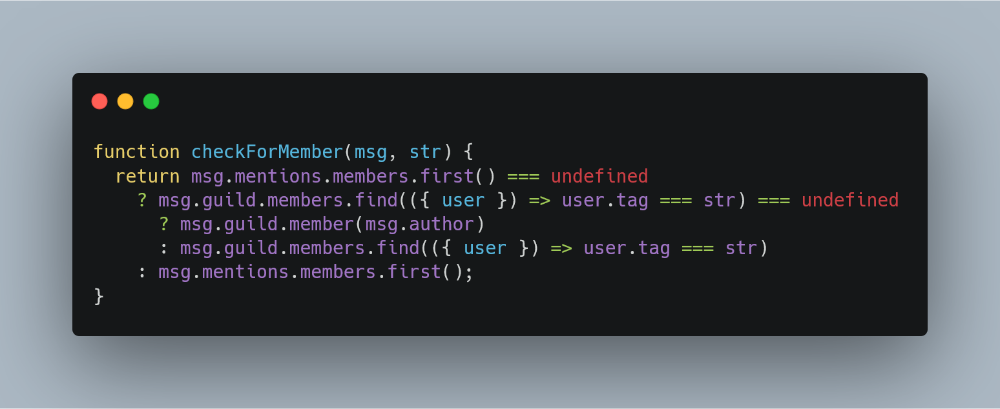

# Snippets ✂

## Contents 📜

- [Discord.js](#discord.js)
  - [Calculating a member's join position](#calculating-a-member's-join-position)
  - [Check if a message was sent in a server](#check-if-a-message-was-sent-in-a-server)
  - [Check for a member's tag or a user mention in a string](#check-for-a-member's-tag-or-a-user-mention-in-a-string)

### Discord.js

#### Calculating a member's join position

#### Check if a message was sent in a server

#### Check for a member's tag or a user mention in a string and return a [GuildMember](https://discord.js.org/#/docs/main/stable/general/welcome)

